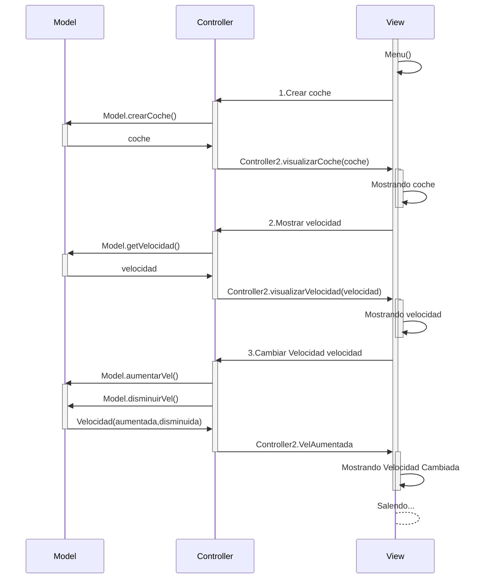

Para empezar, modifique la class coche añadiendole deposito, despues empleee esa variable en el model retornandola como int y en el controller para calcular la diferencia de lo que le queda con lo que tenia inicialmente y lo saque por pantalla en la view
Para el caso del avance lo que hice fue pedirle la velocidad de la matricula que quiere y retornanrla en el model, una vez la tenga la iguale en el controller a un int y le pedi al usuario que me diera el tiempo que estubo sin detenerse con lo que solo las multiplique y retorne.

