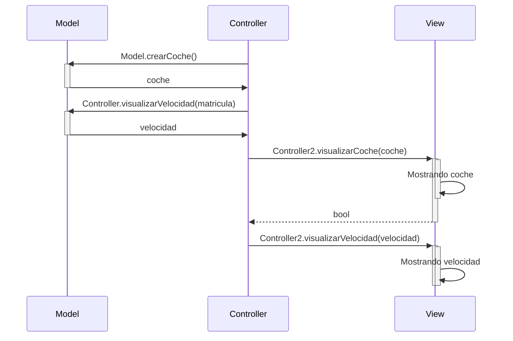

```mermaid
sequenceDiagram 
    participant Model
    participant Controller
    participant View

    Controller->>Model: Model.crearCoche()
    activate Model
    Model->>Controller: coche
    deactivate Model
    Controller->>Model: Controller.visualizarVelocidad(matricula)
    activate Model
    Model->>Controller: velocidad
    deactivate Model
    Controller->>+View: Controller2.visualizarCoche(coche)
    activate View
    View->>-View:Mostrando coche
    View-->>Controller: bool
    deactivate View
    Controller->>+View: Controller2.visualizarVelocidad(velocidad)
    activate View
    View->>-View: Mostrando velocidad
    deactivate View
    

```
