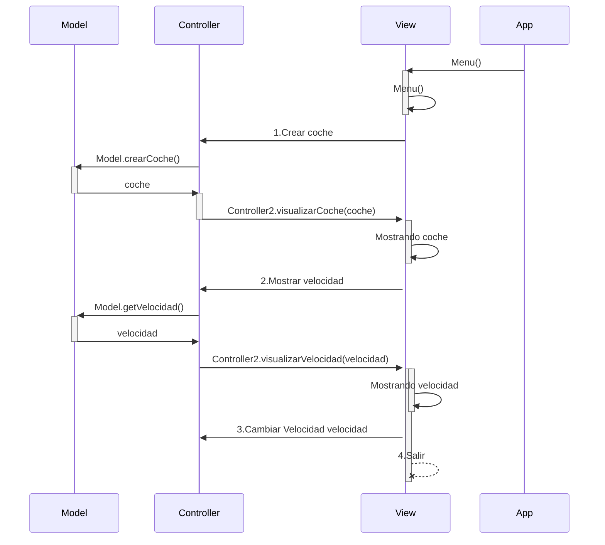

```mermaid
sequenceDiagram 
    participant Model
    participant Controller
    participant View


    App->>View: Menu()
    activate View
    View->>-View:Menu()
    View->>Controller:1.Crear coche

    Controller->>Model: Model.crearCoche()
    activate Model
    Model->>Controller: coche
    deactivate Model
    activate Controller
    Controller->>+View: Controller2.visualizarCoche(coche)
    deactivate Controller
    activate View
    View->>View:Mostrando coche
 
    
    deactivate View
    View->>Controller:2.Mostrar velocidad
    Controller->>+Model: Model.getVelocidad()
    Model->>Controller:velocidad
    deactivate Model
    Controller->>+View: Controller2.visualizarVelocidad(velocidad)
    activate View
    View->>-View: Mostrando velocidad
    View->>Controller:3.Cambiar Velocidad velocidad
    View--xView:4.Salir
    deactivate View
    

    
    
    

```
