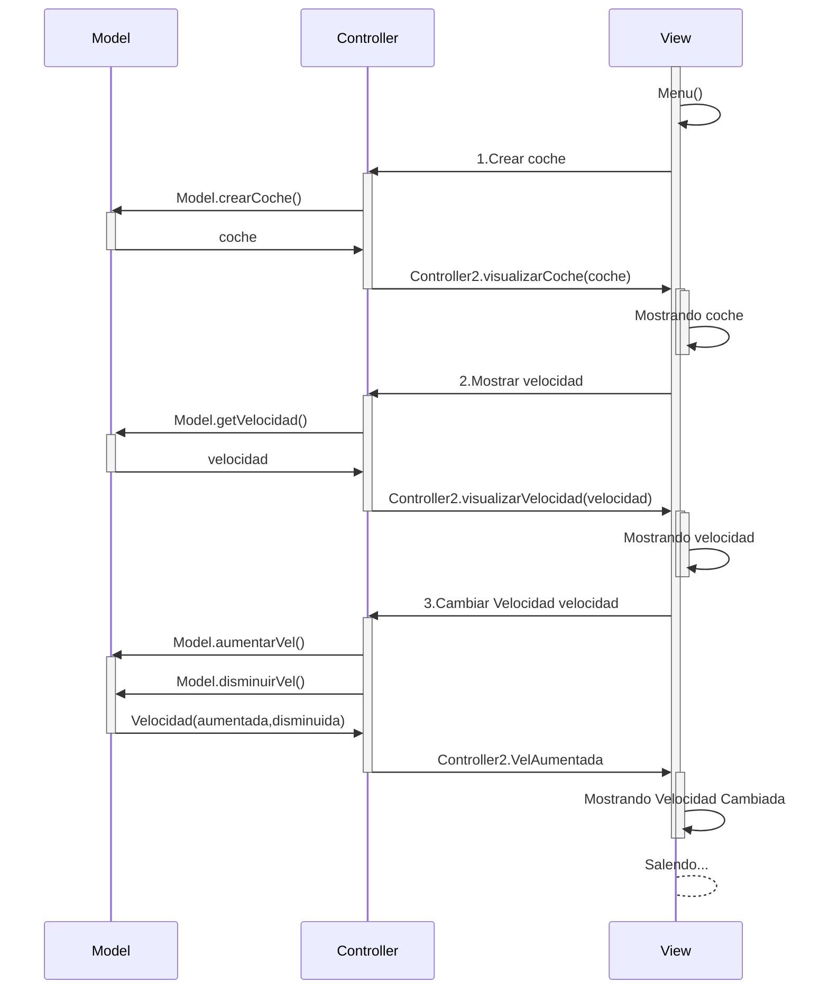

```mermaid
sequenceDiagram 
    participant Model
    participant Controller
    participant View


    
    activate View
    View->>View:Menu()
    
    View->>Controller:1.Crear coche
    activate Controller
    Controller->>Model: Model.crearCoche()
    activate Model
    Model->>Controller: coche
    deactivate Model
    Controller->>+View: Controller2.visualizarCoche(coche)
    deactivate Controller
    activate View
    View->>View:Mostrando coche
    deactivate View
    deactivate View
    View->>Controller:2.Mostrar velocidad
    activate Controller
    Controller->>+Model: Model.getVelocidad()
    Model->>Controller:velocidad
    deactivate Model
    Controller->>+View: Controller2.visualizarVelocidad(velocidad)
    deactivate Controller
    activate View
    View->>-View: Mostrando velocidad
    deactivate View
    View->>Controller:3.Cambiar Velocidad velocidad
  activate Controller
    Controller->>Model:Model.aumentarVel()
    activate Model
    Controller->>Model:Model.disminuirVel()
    Model->>Controller:Velocidad(aumentada,disminuida)
    deactivate Model
    Controller->>+View:Controller2.VelAumentada
    deactivate Controller
    View->>View:Mostrando Velocidad Cambiada
    deactivate View
    deactivate View
    View-->View:Salendo...
    
    

```
